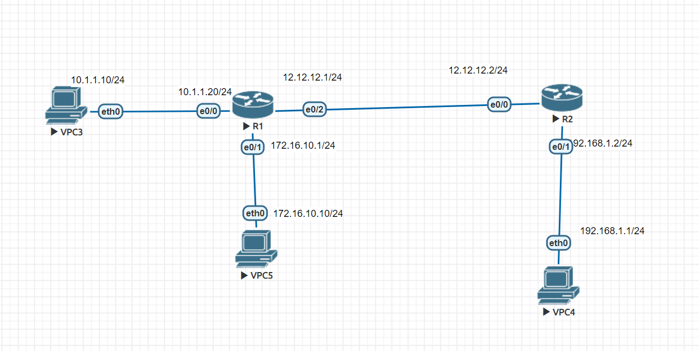

# ACL (Cisco Router 存取控制)


* [參考](https://blog.xuite.net/tolarku/blog/38160949-%5BCCNA%5D+Cisco+Router+%E5%AD%98%E5%8F%96%E6%8E%A7%E5%88%B6+-+ACL+-+Standard)
* [參考](http://big5.51job.com/gate/big5/arts.51job.com/arts/03/269687.html)
* [參考](https://kknews.cc/zh-tw/tech/5ll8bak.html)
* 拓譜圖


```
# router(config) access-list 1 permit host 172.168.10.10
# router(config) access-list 1 deny 172.16.10.0 0.0.0.255
# router(config) access-list permit any
# router(config) int e0/1
Router(config-if)#ip access-group 1 out 
```

## Problem
* ACL的in-bound 跟 out-bound差在哪裡?
* 何時要用in 何時要用out?

