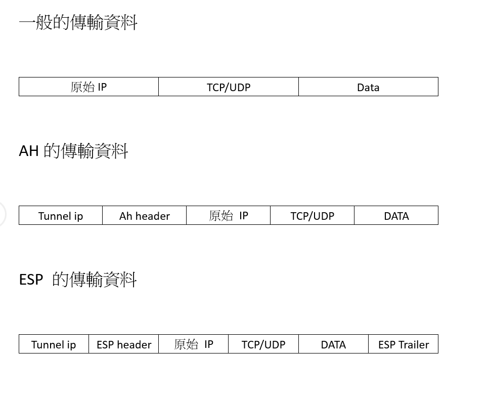
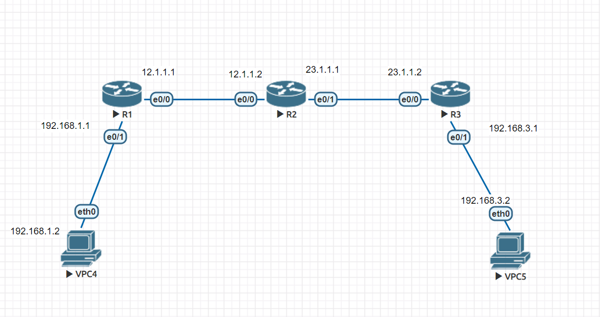

# Site to Site  VPN

## GRE Genenic Routing Encapsulation(通訊路由封裝協定)
[參考](https://www.jannet.hk/zh-Hant/post/generic-routing-encapsulation-gre/)
* 是一種vpn的技術
* port 為 47 
* 至少增加24byte(包含20byte的gre ip 和 4 byte的gre header)
* 將192.168.1.1 的封包經由tunnel傳送至192.168.2.1
* 封包裡面中間先包著data再包著來源ip(private ip)再包著ip(public ip)
* 具備多協議,可將Ipv6,ipv4都封裝在tunnel內
* 安全性弱(沒有加密)
* 在tunnel傳送時會有三組ip
* 可以支援廣播群播

* 會在12.1.1.1 與 23.1.1.2之間建立一個虛擬的網路隧道(tunnel)


R1 設置
```
# Router(config) ip route 0.0.0.0 0.0.0.0 12.1.1.2
# Router(config) int tunnel 13 //13是自己取的名字 這邊r1到r3所以叫做13
# Router(config-if) ip addr 1.1.1.1 255.255.255.0
# Router(config-if) tunnel sourse 12.1.1.1
# Router(config-if) tunnel destination 23.1.1.2
# Router(config)ip route 192.168.2.0 255.255.255.0 1.1.1.2
//動態路由
# Router(config) route rip
# ROuter(config-route) version 2
# ROuter(config-route) no auto-summary
# ROuter(config-route) network 1.1.1.1
# ROuter(config-route) network 192.168.1.0
```
R2 設置
```
# Router(config) ip route 0.0.0.0 0.0.0.0 23.1.1.1
# Router(config) int tunnel 13 //13是自己取的名字 這邊r1到r3所以叫做13
# Router(config-if) ip addr 1.1.1.2 255.255.255.0
# Router(config-if) tunnel sourse 23.1.1.2
# Router(config-if) tunnel destination 12.1.1.1
# Router(config)ip route 192.168.1.0 255.255.255.0 1.1.1.1 //靜態路由 也可以使用動態路由 
//動態路由
# Router(config) route rip
# ROuter(config-route) version 2
# ROuter(config-route) no auto-summary
# ROuter(config-route) network 1.1.1.2
# ROuter(config-route) network 192.168.2.0
```

## IP spec
[參考](https://www.jannet.hk/zh-Hant/post/internet-protocol-security-ipsec/)
* 身分驗證: 會在phase1來進行辨別是否是同間公司
,會用一個密碼來判斷是否是對方
* 機密性: 使用安全加密來傳輸DES,NES(公開加密)
* 完整性: 先將資料進行SHA-1 或是 MD5 來產生HASH值比對資料是否經過串改
* 防重放攻擊(Replay attack) : 拒絕收過的資料 


## IP spec (Tunnel Mode)
* [參考](https://ccie.lol/knowledge-base/ipsec-two-mode/)
* 分成AH ,ESP封裝
1. AH 只包含Authnication 認證而已
2. ESP 包含身分認證還有資料加密

 

## 實作


* 先設定Toplogy的IP
* Phase 1


* 新增acl條件
```
R1(config)# ip access-list extended VPN-Traffic
R1(config-ext-nacl)# permit 192.168.1.0 0.0.0.255 192.168.3.0 0.0.0.255 
```

* 設定IKE phase參數
  - authtication pre-share : 雙方用一樣的密碼來確認
  - lifetime : 預設為86400
  - R1 R2都要設定一樣的參數來辨別
```
R1(config)# cryptoisakmp policy 1
R1(config-isakmp)#encrption aes
R1(config-isakmp)#hash md5
R1(config-isakmp)#authentication pre-share
R1(config-isakmp)#authentication pre-share
R1(config-isakmp)#lifetime 30000

```
* 設定IKE Phase1 的PRE-SHARE KEY
   - R1 R2都要設定
```
R1(config)#crypto isakmp key 6 ccie address 23.1.1.2
```

* 設定IKE Phase2 的參數
  - tranform-set 後面是宣告名稱 第一個參數 esp-3des為加密方式,ah-sha-hmac 為驗證方式 ,兩邊的路由器都必須設定相同的內容
  - R1 R2都要設定一樣的參數來辨別
```
R1(config)#crypto ipsce tranform-set TS esp-3des ah-sha-hmac
```
* 定義Crypto MAP 然後將之前的Crypto Map的內容放進interface
  - R1 R2接要設定相同參數
```
R1(config)#crypto map CMAP 1 ipsec-isakmp
R1(config-crypto-map)#set peer 23.1.1.2
R1(config-crypto-map)#set transform-set TS
R1(config-crypto-map)#match address VPN-Traffic
R1(config)#crypto map CMAP
```

## IP spec over GRE
[參考](https://www.jannet.hk/zh-Hant/post/generic-routing-encapsulation-gre/#ipsec)

