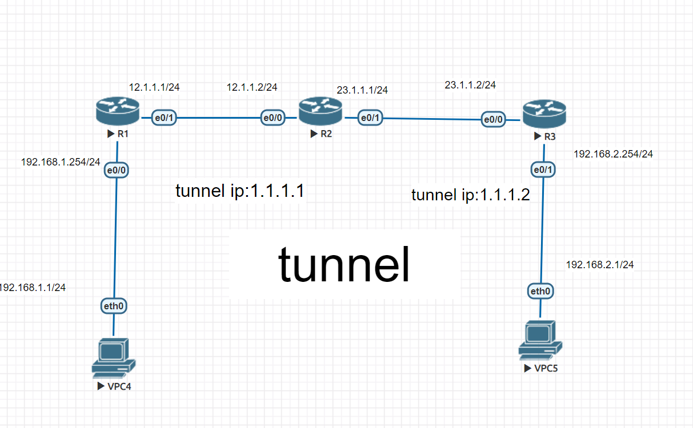

# Site to Site  VPN

## GRE Genenic Routing Encapsulation(通訊路由封裝協定)
* 是一種vpn的技術
* 將192.168.1.1 的封包經由tunnel傳送至192.168.2.1
* 封包裡面中間先包著data再包著來源ip(private ip)再包著ip(public ip)
* 在tunnel傳送時會有三組ip

* 會在12.1.1.1 與 23.1.1.2之間建立一個虛擬的網路隧道(tunnel)


R1 設置
```
# Router(config) ip route 0.0.0.0 0.0.0.0 12.1.1.2
# Router(config) int tunnel 13 //13是自己取的名字 這邊r1到r3所以叫做13
# Router(config-if) ip addr 1.1.1.1 255.255.255.0
# Router(config-if) tunnel sourse 12.1.1.1
# Router(config-if) tunnel destination 23.1.1.2
# Router(config)ip route 192.168.2.0 255.255.255.0 1.1.1.2
//動態路由
# Router(config) route rip
# ROuter(config-route) version 2
# ROuter(config-route) no auto-summary
# ROuter(config-route) network 1.1.1.1
# ROuter(config-route) network 192.168.1.0
```
R2 設置
```
# Router(config) ip route 0.0.0.0 0.0.0.0 23.1.1.1
# Router(config) int tunnel 13 //13是自己取的名字 這邊r1到r3所以叫做13
# Router(config-if) ip addr 1.1.1.2 255.255.255.0
# Router(config-if) tunnel sourse 23.1.1.2
# Router(config-if) tunnel destination 12.1.1.1
# Router(config)ip route 192.168.1.0 255.255.255.0 1.1.1.1 //靜態路由 也可以使用動態路由 
//動態路由
# Router(config) route rip
# ROuter(config-route) version 2
# ROuter(config-route) no auto-summary
# ROuter(config-route) network 1.1.1.2
# ROuter(config-route) network 192.168.2.0
```

## IP spec
[參考](https://www.jannet.hk/zh-Hant/post/internet-protocol-security-ipsec/)

## IP spec over GRE
[參考]()