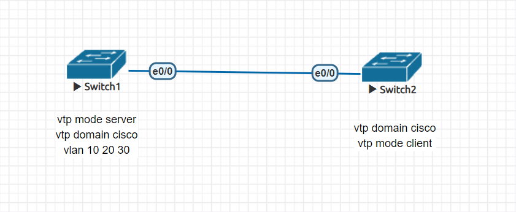
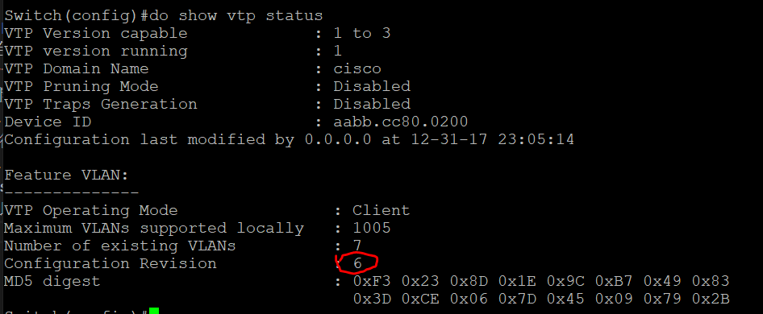

## Vtp 實驗

* vtp的同步機制是來自revision的版本號來進行同步的
* 初始條件

1. 一開始先將S1 設為vtp server
2. S2 設為 vtp client
3. 隨後在S1 vlan 10 20 30
4. S2 自然也會增加vlan 10 20 30
5. 當server 再新增或刪除vlan時 ,會像git一樣將版本做commit
6. 所以增加了3個vlan時,version應該為3(可用show vtp status查驗)
* 如下圖 此圖為增加6個vlan時的版本

7. 如果此時將S2的e0/0接口關閉並將vpt mode 改為server
8. 再新增或進行刪除vlan的操作 也會將version不斷的增加
9. 最後再把mode server 改為 mode client 並將e0/0開啟
10. S1(server)卻會被S2(client)所覆蓋,其原因就為version版本的緣故

