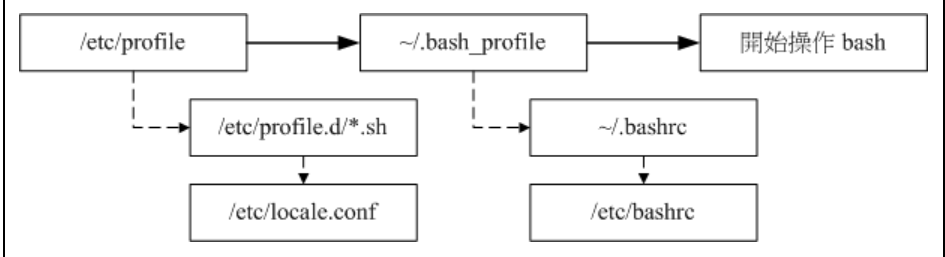

# 永久的alias設定

## 題目 : 對系統創建命令為qstat 可以執行/bin/ps -Ao pid,tt,user,fname,rsz

* 編輯環境
```
# vim /etc/bashrc
```
* 增加他要的指令

```
alias='/bin/ps -Ao pid,user,fname,rsz'
```

* 立即生效

```
# source /etc/profile
```

* 環境設置圖

* 參考於[鳥哥私房菜](http://linux.vbird.org/linux_basic/0320bash.php#alias)